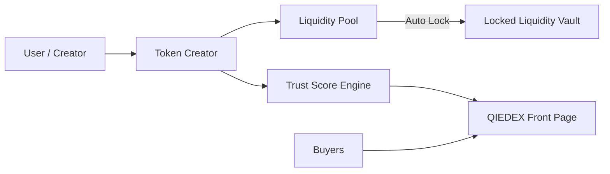

# QIEDEX – Trust-First Token Creation & Liquidity Platform

QIEDEX is a **free token creator and liquidity platform** built for the QIE blockchain that focuses on **killing scams, rug-pulls, and fake projects by design**with a real world impact.  
Instead of letting anyone create dangerous tokens, QIEDEX enforces **fair launch, locked liquidity, and visible trust signals** from day one.

This project is built for the **QIE Blockchain**.

---
## How to Run the Project (Using Docker)

```bash
docker run -p 4000:4000 madhesh00/qie-indexer:latest[http://localhost:4000]
docker run -p 5173:80 madhesh00/qie-frontend:latest[http://localhost:5713]
docker compose up
````

---
## What Problem This Solves

Today in token platforms:
- Anyone can launch a token in 2 clicks
- Devs hide 99% supply
- Liquidity can be removed anytime
- Users can’t tell scams from real projects

Result:
- New users lose money
- Real builders avoid the chain
- The ecosystem stays empty

QIEDEX fixes this **by force, not by trust**.

---

## Workflow Explained (Very Simple)

### Step 1 – Token Creation

User creates a token using QIEDEX’s free creator.

### Step 2 – Fair Launch Enforcement

Creator receives *0 pre-mine*.
Tokens are only obtained by buying or adding liquidity.

### Step 3 – Liquidity Lock

100% of provided liquidity is *automatically locked* for 6–12 months.

### Step 4 – Trust Score Assignment

Token gets a *Green / Yellow / Red* trust label shown publicly.

### Step 5 – Public Trading

Users instantly know whether a token is safe before buying.

---

## High-Level Architecture




---

## Core Features

| Feature                               | What It Does (Super Simple)       | Which Pain Points It Kills |
| ------------------------------------- | --------------------------------- | -------------------------- |
| Mandatory 6–12 Month Locked Liquidity | Liquidity cannot be removed early | Kills rug-pulls forever    |
| Fair Launch by Default                | Creator gets 0 pre-mine           | Kills hidden dev wallets   |
| Built-in Trust Score                  | Green / Yellow / Red safety label | Kills scam confusion       |
| Public Trust Display                  | Safety shown on front page        | Users decide in 1 second   |
| Real Asset Mode                       | Locked team tokens + identity     | Enables serious projects   |

---

## Prerequisites

Make sure you have:

- Node.js **v18 or above**
- npm
- Git
- Docker
- Node


---

## How to Run the Project (Local)

### 1. Clone the Repository

```bash
git clone (https://github.com/hari-hara-sudharsan/Blockchain-TokenCreator.git)
````

---

### 2. Install Backend Dependencies

```bash
cd indexer
npm install
node index.js
```

Backend runs on:

```
http://localhost:4000
http://localhost:4000/tokens [for real time tokens]
http://localhost:4000/tokens/{0Xaddress} [token details for a particular user]
```

---

### 3. Install Frontend Dependencies

Open a new terminal:

```bash
cd frontend
npm install
npm run dev
```

Frontend runs on:

```
http://localhost:5173
```


### 4.Contracts

Open a new terminal:

```bash
cd contract
npx hardhat compile
npx hardhat run scripts/deploy-factory.js --network qie_testnet

```

---

## Trust Score Logic (Simple)

* **Green**
  Liquidity locked + fair launch + optional identity

* **Yellow**
  Normal settings, still visible

* **Red**
  Dev kept tokens or early unlock

No guessing. No research needed.

---
## What Makes QIEDEX Different

| # | Difference | What It Means (Simple) | Why It Matters |
| - | ---------- | ---------------------- | -------------- |
| 1 | No Rug Possible | Liquidity cannot be removed early | Users cannot be scammed |
| 2 | Mandatory Fair Launch | Creator gets zero pre-mine | No hidden dev advantage |
| 3 | Automatic Trust Signals | Trust score shown by default | Users decide instantly |
| 4 | Scam Flagging | Risky tokens are marked clearly | Scammers lose visibility |
| 5 | Serious Asset Support | Real projects get safer launch rules | Real money can enter |

---

## What Is Included

| # | Feature | What It Does | Why It Is Important |
| - | ------- | ------------ | ------------------- |
| 1 | Free Token Creator | Create tokens without cost | Low barrier to entry |
| 2 | Auto-Locked Liquidity | Liquidity is locked by default | Prevents rug pulls |
| 3 | Trust Score Engine | Assigns Green / Yellow / Red | Clear safety indicator |
| 4 | Fair Launch Enforcement | No pre-mine allowed | Equal start for everyone |
| 5 | Real-Asset Launch Mode | Supports serious use cases | Attracts real projects |
| 6 | Public Safety Signals | Safety shown on front page | Reduces user confusion |

---

## Real Pain Points This Solves

| # | Pain Point        | What Happens Today          | Why It Kills Projects   |
| - | ----------------- | --------------------------- | ----------------------- |
| 1 | Zero Liquidity    | Token exists but no trading | Token becomes worthless |
| 2 | Rug Pulls         | Dev removes liquidity       | Users lose everything   |
| 3 | Fake Volume       | Dev trades with self        | Investors get trapped   |
| 4 | No Real Use       | Meme tokens only            | Tokens die in days      |
| 5 | Impermanent Loss  | LPs lose money              | Liquidity disappears    |
| 6 | Scam Flood        | 99% fake tokens             | Users leave ecosystem   |
| 7 | No Serious Assets | No compliance tools         | Big money never enters  |


---

## Why This Matters for QIE Blockchain

* Protects new users
* Attracts serious builders
* Reduces scam noise
* Builds long-term trust
* Enables real-world assets

---
## Resources

- [QIE Official Docs](https://docs.qie.digital/))
- [QIE Developer Docs](https://docs.qie.digital/developer-docs)
- [QIE Github](https://github.com/Qi-Blockchain)
- [QIE Mainnet](http://www.mainnet.qie.digital/)
- [QIEDEX](https://youtu.be/_lySE370sGk?si=CONBADOBCu5NqfqC)

---
## License

MIT
